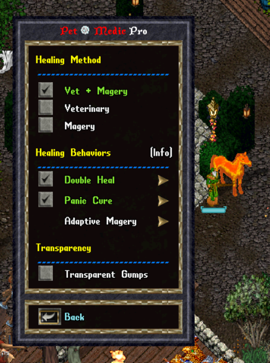

# PetMedic Pro

**Adaptive companion healing for UOAlive, ClassicUO, and Razor Enhanced.**

[**Download PetMedic Pro 2.1**](https://raw.githubusercontent.com/TBru81/PetMedic-Pro/main/PetMedic%20Pro%20v2.1.py) · [View source](PetMedic%20Pro%20v2.1.py) · [Release notes](RELEASE_NOTES_v2.1.md)

> Always use the download link above for the current production version. Copies shared elsewhere may be outdated.

PetMedic Pro is more than a typical “heal as fast as possible” script. It adapts to your pet’s condition and gives you healing options designed to complement your character’s skills and play style.

Whether you rely on Veterinary, Magery, or a combination of both, PetMedic Pro responds differently as the situation changes—providing efficient everyday healing while reserving its strongest responses for when your pet truly needs them.

## Healing methods

| Method | How it works |
| --- | --- |
| **Veterinary** | Uses bandages to heal injuries and cure poison while the pet is within bandage range. |
| **Magery** | Uses Heal or Greater Heal according to the pet’s health. When poison is detected, it switches to Arch Cure until the poison clears. |
| **Vet + Magery** | Adapts automatically to distance. Veterinary handles routine healing and poison within bandage range; outside that range, Magery takes over with Heal, Greater Heal, or Arch Cure. Optional Double Heal and Panic Cure provide additional emergency support. |

## Adaptive Magery — passive behavior

- Above 75% health, PetMedic Pro uses **Heal** for a faster response and lower mana consumption.
- At 75% health or lower, it uses **Greater Heal** for stronger recovery.
- This automatic background behavior applies whenever Magery is active, alone or with Veterinary.

## Double Heal

- At 50% health or lower, both healing sources activate.
- Veterinary and Magery work together until the pet recovers to 75% health.
- This behavior can be enabled or disabled independently and defaults to enabled.
- This option applies to **Vet + Magery** mode.

## Panic Cure

- Veterinary normally handles poison while the pet is within bandage range.
- If the pet remains poisoned at 40% health or lower after two completed bandage attempts, Arch Cure provides emergency support.
- Panic Cure ends as soon as the poison clears.
- This behavior can be enabled or disabled independently and defaults to enabled.
- This option applies to **Vet + Magery** mode.

## Designed around real play

- Automatically switches between Veterinary and Magery as the pet moves into or out of bandage range.
- In Vet + Magery mode, Magery takes over when bandages run out; Veterinary resumes automatically when bandages return.
- In Veterinary-only mode, healing pauses when bandages run out so the player can restock and choose when to resume.
- Warns after repeated Magery range failures without preventing later healing attempts.
- Provides manual Pause and Resume controls.
- Remembers the selected pet and healing method separately for each character.
- Restores the saved pet after script restarts and login cycles, including when the pet becomes available shortly after login.
- Uses immersive, color-coded journal messages for option changes, warnings, and errors.
- Offers a per-character Transparency option for a clear, movable interface across every PetMedic gump.

## Getting started

1. [Download PetMedic Pro 2.1](https://raw.githubusercontent.com/TBru81/PetMedic-Pro/main/PetMedic%20Pro%20v2.1.py).
2. Add the script to Razor Enhanced and start it.
3. Select **Target Pet**, then target the companion you want to tend.
4. Open **Options** and choose Veterinary, Magery, or Vet + Magery.
5. If using Vet + Magery, choose whether to enable Double Heal and Panic Cure.
6. Optionally enable Transparent Gumps as the final Options setting.

PetMedic Pro saves your selected pet and healing method in `PetMedicPro_Settings.json`. The saved pet name may appear a moment after login while the game makes that companion available.

## Server rules and responsible use

PetMedic Pro is designed for attended play on your actively controlled account. Do not use it for unattended combat, AFK item gain, or healing and curing assistance from another account. Players remain responsible for using the tool in accordance with the [UOAlive Server Rules](https://uoalive.com/wiki/Server_Rules).

## Resource behavior

- Keep bandages in your backpack when using Veterinary.
- Magery still depends on sufficient mana and either reagents or Lower Reagent Cost equipment.
- If a spell cannot be cast, Ultima Online displays its native warning. PetMedic Pro remains available for the next valid healing opportunity.

## Compatibility and validation

PetMedic Pro 2.1 was live-tested with **UOAlive**, **ClassicUO**, and **Razor Enhanced**. Validation covered every healing method, Double Heal enabled and disabled, Panic Cure enabled, resource fallback, pause and resume behavior, saved preferences, targeting failure, and opaque and transparent interface behavior. The rare Panic Cure-disabled emergency condition was additionally verified through code review.

## Files

- [Production release](PetMedic%20Pro%20v2.1.py)
- [PetMedic Pro 2.1 release notes](RELEASE_NOTES_v2.1.md)
